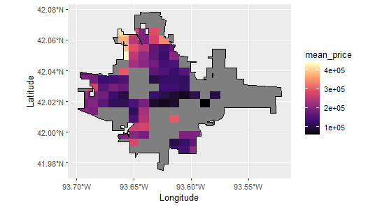
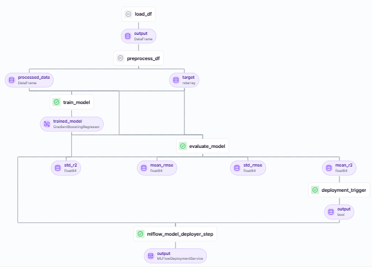

# HOUSING PRICE PREDICTIONS

### DATASET  DESCRIPTION:

The dataset contains descriptions and prices of 1000 houses in Ames, Iowa. The goal of the project was to predict housing prices from the 79 features used to describe the houses. 

The features describing the houses included house condition, description of living room, bedrooms, basement, garage, and other spaces in the house, and other features describing the land around the house, neighborhood, street, etc.

The housing prices were distributed as following:

* The average house price was $ 177, 932
* Half of the houses had a price lower than $ 161, 625
* The most common house price was $ 135, 000

The spatial distribution of the houses and prices can be visualized by the figures below. The borders show the Ames city limits. The red dots in the first plot show the location of the houses and the second plot the price variation in different parts of the city.

### KEY TAKEAWAYS FROM THE STUDY

#### Exploratory data analysis

1. Most of the houses were in average condition: Overall quality between 5 to 7 (on a scale of 1 to 10) for 75% of the houses and Overall condition between 5 to 7 (scale of 1 to 10) for 88%.

2. 95% of the houses had between 2 to 4 bedrooms.

3. About 93% houses had 1 to 3 car garages.

4. Most houses were sold between 2008 - 2009 almost evenly.

#### Temporal dependence of sales and sale price

There was some seasonality in the month of sale: in the months between January - April, about 25% of the houses were sold. 50% of the houses were sold between the peak months of May to July. The rest of the months, August to December sold only 25% of the houses. We also observed a trend of increasing average sale price and price per square feet with increasing year of remodeling. The temporal modeling/forecasting of sale prices is not part of this work but is in progress.

#### Predictive modeling

The workflow of model training can be illustrated as below. The model is evaluated on the mean R2 scores from 5-fold cross validation. If the mean R2 score is greater than 0.8, then the trained model is deployed. The work follows the MLOps framework that includes experiment tracking, inference, and detecting data drift between training and test set.

We found that overall material and finish of the house, rated between 1 (very poor) to 10 (very excellent), as well as the quality of the material on the exterior (Excellent, Good, Typical, Fair) were the most related to the house price. Houses with excellent quality material, finish and exterior were priced higher and vice versa.

### HOUSE PRICE PREDICTIONS

The workflow of model inference can be illustrated as follows:

The data drift detection workflow is shown below along with the output of the pipeline (no noticeable drift was observed):

We trained a model to predict house prices based on their features. We then tested the model on a test dataset of 100 houses. From the figure below, we see that our predicted prices are very close to the actual prices. The overall error in prediction is $16,400.

We also looked at the features that played the most important role in predicting the prices. 'Overall Material and Finish of House' and 'Living Room Area' were the two most important predictive features.

